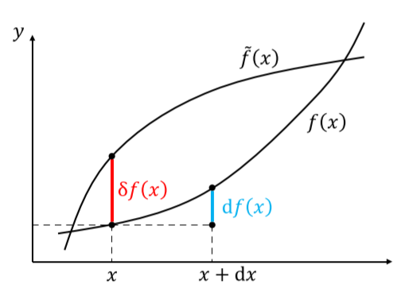
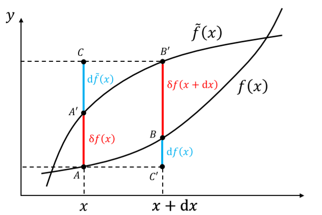

# 经典力学

## 变分法

​	变分的概念，就是函数的“微分”在“泛函”上的对应。泛函是函数到数的映射，函数本身的无穷小变化，以及由此引起的泛函的变化就是变分。变分和微分的区别可见下图

​	变分可以理解为
$$
\delta f(x) \equiv (\delta f)(x) 
$$
即$\delta f$自己就是一个函数，只不过是无穷小的。区别于微分，变分得到的值直接从宗量获得，微分则是通过宗量对函数值的改变而得到的微分值。

​	相比于微分，变分有一个重要且非常有用的性质，即变分和微分可以交换顺序，由此得到
$$
\delta(\mathrm{d} f) = d(\delta f)
$$
证明可利用下面的图：

### 泛函导数

​	先考虑函数的导数。可以知道，函数的微分是由宗量的微分引起的，也就是
$$
\begin{aligned}
f(x) & \rightarrow f(\tilde{x}) \\
&=f(x+\epsilon \mathrm{d} x) \\
&=f(x)+\epsilon \mathrm{d} f(x)+\frac{\epsilon^{2}}{2} \mathrm{d}^{2} f(x)+\frac{\epsilon^{3}}{3 !} \mathrm{d}^{3} f(x)+\cdots \\
&:=f(x)+\epsilon \frac{\mathrm{d} f(x)}{\mathrm{d} x} \mathrm{d} x+\frac{\epsilon^{2}}{2} \frac{\mathrm{d}^{2} f(x)}{\mathrm{d} x^{2}}(\mathrm{d} x)^{2}+\frac{\epsilon^{3}}{3 !} \frac{\mathrm{d}^{3} f(x)}{\mathrm{d} x^{3}}(\mathrm{d} x)^{3}+\cdots
\end{aligned}
$$
由此得到普通导数的定义。参考这个形式，泛函的变分是由宗量的变分引起的，即
$$
f(x) \to \tilde{f}(x) = f(x) + \varepsilon \delta f(x)
$$
这意味着泛函的变分是直接跟函数的变化有关的。由于泛函的变分最后要得到的是一个数，而如何将函数的变化和数联系起来呢？联想到函数的变化其实也可以视为一个函数，所以答案是积分。参考前面微分的定义，可以得到泛函导数的定义。在下面这个例子中
$$
\delta S[f] := \int \mathrm{d} x \frac{\delta S}{\delta f(x)}\delta f(x)
$$
一阶泛函导数为
$$
\frac{\delta S}{\delta f(x)}
$$
​	一阶泛函导数的作用，**是将函数的变分$\delta f(x)$（一个无穷小的函数）映射到泛函的变分$\delta S$（一个无穷小的数）**，也就是说，一阶泛函导数其实也是一个泛函。这里其实类比微分导数可以发现相似性：微分导数是函数对数的导数，最后得到一个函数；而泛函导数则是泛函对函数的“导数”，最后得到一个泛函。

​	到这里其实我们还不知该怎么计算泛函导数。依旧是类比微分，观察$S[\tilde{f}] = S[f+ \varepsilon\delta f]$。如果我们将$\delta f$作为一个固定值，则泛函的变化其实完全依赖于$\varepsilon$，也就是说，这个泛函其实退化成了一个**函数**。我们可以利用针对$\varepsilon$的普通泰勒展开得到泛函导数，经过比较可得一阶泛函导数
$$
\delta S[f]:=\left.\int \mathrm{d} x \frac{\delta S}{\delta f(x)} \delta f(x) \equiv \frac{\mathrm{d}}{\mathrm{d} \epsilon} S[\phi+\epsilon \delta f]\right|_{\varepsilon=0}
$$
这也被称为泛函导数的**操作定义**。

### 一种特殊形式下的泛函导数求解

​	对于类似如下形式的泛函，其导数的求解可以更加简便。
$$
S[f]=\int_{x_{1}}^{x_{2}} \mathrm{d} x L\left(x, f(x), f^{\prime}(x), f^{\prime \prime}(x), \cdots, f^{(n)}(x), \cdots\right)
$$

步骤如下：

1. 将变分符号移到积分号内
2. 计算$\delta L$的变分，按照莱布尼兹规则和链式法则，按部就班展开即可
3. 做分部积分，将$\delta f$的导数移除
4. 注意变分法的一个基本假设：在积分端点（边界）处，函数及其导数的变分为零。这个值也被称为边界项或表面项，可以不为零，但令其为零是一种普遍而方面的做法

对于泛函导数的计算来说，边界项无关紧要，因为在变分中这个值可以被直接舍掉，类似于微分导数中的常数项。同时，对于两个式子差一个全导数或者差一个边界项这种事情，用一个专门的符号$\simeq$来表示。

5. 提取$\delta f$前的系数，即一阶泛函导数。一阶泛函导数如下

    ##### 

$$
\frac{\delta S[f]}{\delta f}=\sum_{n=0}(-1)^{n} \frac{\mathrm{d}^{n}}{\mathrm{d} x^{n}}\left(\frac{\partial L}{\partial f^{(n)}}\right)
$$

### $\delta$ 函数作为泛函

​	考虑一个特殊的泛函
$$
f(x_0) \equiv f(x_0)[f]
$$
即将函数在某一点的值视为这个函数自身的泛函。这个泛函本身并不需要积分，但可以试着人为地定义一个所谓的**$ \delta$函数​**，写成积分形式
$$
f\left(x_{0}\right):=\int_{x_{1}}^{x_{2}} \mathrm{d} x \delta\left(x_{0}-x\right) f(x) \equiv f\left(x_{0}\right)[f]
$$
这其实正是$\delta$函数更为本质的定义，即它其实是个泛函。利用这个定义得到$\delta$函数导数的定义，也就是说，它们在之前并没有定义。

### 泛函极值

​	泛函取极值的条件与函数取极值的条件非常类似
$$
\left.\frac{\delta S[f]}{\delta f}\right|_{f=f_0(x)} = 0
$$
和一阶导数的情况类似，一阶泛函导数为零只是泛函取极值的必要而非充分条件。同样利用$\varepsilon$可以证明这个结论。

#### 欧拉-拉格朗日方程

​	物理中大部分感兴趣的系统都是这种情形
$$
S[f] = \int_{x_1}^{x_2}\mathrm{d} x L (x,f(x),f^{\prime}(x))
$$
其特点是，泛函的被积函数$L$最高包含$f$的一阶导数。根据之前的结论，泛函取极值的必要条件是
$$
- \frac{\delta S}{\delta f} \equiv \frac{\mathrm{d}}{\mathrm{d}x}\left(\frac{\partial L}{\partial f^{\prime}}\right) - \frac{\partial L}{\partial f} = 0
$$
​	对于欧拉方程，有一个重要结论：如果泛函$S[f]$对应的被积函数$L$含有最高位$f(x)$的$N$阶导数且非退化（即$N$阶导数包含$f(x)$），则泛函导数包含最高至$f(x)$的$2N$阶导数（这是由于需要求$\frac{\delta S}{\delta f}$关于$x$的$N$阶导数），相应泛函极值的欧拉-拉格朗日方程为$2N$阶微分方程。

#### 多个变量与多元函数

​	如果多个变量之间相互独立，则满足线性叠加原理。最后泛函取极值也就是对每个变量的泛函导数都为0.

​	对于多元函数的情况，其实也是同样的道理，在和$f$的导数有关的那项对每一个宗量进行分别求导并线性叠加就行了，如下
$$
\frac{\delta S}{\delta f}=\frac{\partial L}{\partial f}-\sum_{i=1}^{n} \frac{\partial}{\partial x_{i}}\left(\frac{\partial L}{\partial\left(\frac{\partial f}{\partial x_{i}}\right)}\right)=0
$$

## 位形空间

​	位形即力学系统各个指点的空间位置，质点系或者更一般力学体系在空间中的**形状、分布**，也就是主要在$x$空间下的反映。系统所有可能位形的集合，就构成位形空间，而位形空间中的每一点，意味着系统的一种可能位形，即，一个点其实代表着一个可能，而不仅仅只代表一个点。不过由于很多情况下使用的都是质点模型，所以在**质点近似**下，可以认为就是一个点。

​	加上时间，物体在位形空间可以形成一条线，这被称为世界线。由于某一时刻的位形本身不能唯一确定此前或此后的位形，所以世界线是可以相交的。

​	与之对应，相空间（一般的相空间其实是在动量空间内的，但在经典框架下也可以认为在速度空间内，位形+速度的相空间被称为**速度相空间**）则是将物体的可能状态（位形+速度）视为一个点。考虑时间得到的线则是永不相交的，这说明相空间的点在时间层面具有唯一性。

### 约束

​	约束是对系统所能达到的状态所**强加**的**运动学**限制条件。运动学限定词意味着约束和受力没有关系，它仅仅是在运动学层面定义的概念。所以约束力本质上只是个数学概念。从空间的角度，即**由于约束，状态空间的某些地方无法到达，实际能到达的，只是状态空间的某个子空间**。

​	约束的数学表示为
$$
f\left(\vec{r}_{1}, \cdots, \vec{r}_{N} ; \dot{\vec{r}}_{1}, \cdots, \dot{\vec{r}}_{N} ; t\right)=0
$$
​	约束有以下分类：

#### 完整约束/非完整约束

​	完整约束（又叫几何约束），只是对系统“位形”的约束。由于自由度定义为状态所需的参数的一半，而对位形的约束同时也就能对对应的速度进行约束，这意味着**完整约束具有假定同等大小自由度的作用**。而非完整约束对于自由度的影响相比比较复杂。

​	所有不属于完整约束的约束就是非完整约束，其中最重要的一类是所谓的**不可积微分约束**。约分约束有着如下形式
$$
f\left(\vec{r}_{1}, \cdots, \vec{r}_{N} ; \dot{\vec{r}}_{1}, \cdots, \dot{\vec{r}}_{N} ; t\right)=0
$$
简单来说，就是包含速度的约束。由于速度层面的约束不能像位形层面的约束一般简单地“干掉”两个状态参数，所以会带来比完整约束复杂的效果。而不可积分约束说白了就是不能转变为完整约束。

#### 定长约束/非定长约束

​	定长约束（稳定约束）是不显含时间的约束
$$
f\left(\vec{r}_{1}, \cdots, \vec{r}_{N} ; \dot{\vec{r}}_{1}, \cdots, \dot{\vec{r}}_{N}\right)=0
$$
反之就是非定长约束（不稳定约束）。定长约束具有相对性，在有着相对运动的参考系中则是非定长约束;但反过来，不是所有非定长约束都可以通过参考系变换，成为定长约束。

#### 双侧约束/单侧约束

​	双侧约束是质点始终不能脱离约束，即约束为“等式”;单侧约束中质点可以在某一方面脱离约束，约束是不等式。

### 广义坐标

​	本质上，坐标无非是某种空间的参数化，通过给定一组参数唯一确定空间中的一点，这组参数就被称为坐标。广义坐标即是对位形空间的参数化，是任何一组能够唯一确定系统"位形"的独立参量。

​	位形空间的维数就等于独立广义坐标的个数，而**对于完整约束，广义坐标的个数就是系统的自由度**。这是由于自由度并不只跟位形有关，再考虑到那个二分之一的系数，有可能出现非整数的情况。在完整约束下，一个约束干掉两个状态参量，使得自由度直接和位形参数在数值上相等，这才有这样好的关系。**对于非完整约束，广义坐标的个数大于系统的自由度**。

​	广义坐标的概念，结合自由度体现出，我们的参数选择具有一个最优解，即（在完整约束情况下）当广义坐标数量与自由度一致时，参数选择最优——数量最少，耦合性最低。同时，由于非完整约束实际上只是宏观下的近似，在微观层面，所有的宏观非完整约束不过是电磁力的宏观效果而已，这意味着其实并不存在所谓的**非完整约束**。

​	广义坐标只是位形空间的参数化，所以选择非常任意。原则上，广义坐标的选取有无限多种。量纲不一定是长度量纲，一般也不能随便组合成一个矢量。从广义坐标出发，可以仿照在三维情况下的关系定义广义速度、广义力、广义动量之类的。

## 相对论时空观

​	力学研究物理系统的演化。一个力学系统的运动规律总是在一个时空背景上加以描述。所以**力学的首要问题即是时空观**。

### 基本概念

#### 时空

​	力学研究物理系统的演化规律，演化是由一个个事件组成。物理学中的事件是模型化的概念，认为某一个事件都发生在空间上的某一点，和时间上的某一瞬。事件的集合即为时空，反过来也可以这样认为，**事件是时空中的一个点**。

​	在相对论中，时空的概念是第一性的，而我们熟悉的时间和空间则是导出概念，是特定的观察者对于时空进行的人为的分解（眼见不一定为实）。这意味着**时空是绝对的，时间和空间则是相对的**。

#### 粒子与场

​	时空类似舞台，演员是时空中的物质，即粒子与场。粒子与场其实都是一种抽象的模型化概念，实际的物体是它们的有机统一。

​	粒子（或者说质点）是在运动中忽略了自身内部结构的对象，即在空间中不延展的对象，以至于坍缩为一个点的存在。还有一类对象，在空间中是延展的、连续的、自由度是不可数的，这类系统被称为场。弦和膜都是场在不同维度的表现形式。

​	经典力学的研究对象是点粒子（包括粒子系统），研究场的一般理论被称为场论。

#### 世界线

​	在时空中，粒子的存在是一条线，被称为世界线。这里可以看出，虽然粒子在空间中不延展，但在时间演化的帮助下，在时空中延展。类似时空与时间和空间的关系，世界线是第一性的概念，而三维条件下的点粒子不过是一维时间线和三维空间线的交点，是个导出概念。因为时间和空间的概念都是相对的，所以三维空间点粒子的概念也是依赖于观测者的、相对的。

### 度规