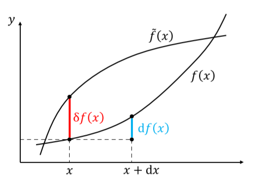
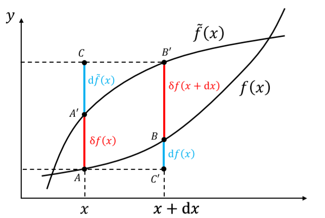
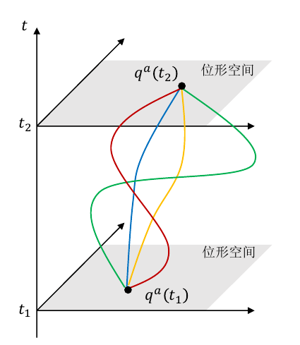

# 经典力学

**TOC**

- [经典力学](#%e7%bb%8f%e5%85%b8%e5%8a%9b%e5%ad%a6)
  - [变分法](#%e5%8f%98%e5%88%86%e6%b3%95)
    - [泛函导数](#%e6%b3%9b%e5%87%bd%e5%af%bc%e6%95%b0)
    - [一种特殊形式下的泛函导数求解](#%e4%b8%80%e7%a7%8d%e7%89%b9%e6%ae%8a%e5%bd%a2%e5%bc%8f%e4%b8%8b%e7%9a%84%e6%b3%9b%e5%87%bd%e5%af%bc%e6%95%b0%e6%b1%82%e8%a7%a3)
    - [$\delta$ 函数作为泛函](#mathsemanticsmrowmi%ce%b4mimrowannotation-encoding%22applicationx-tex%22deltaannotationsemanticsmath%ce%b4-%e5%87%bd%e6%95%b0%e4%bd%9c%e4%b8%ba%e6%b3%9b%e5%87%bd)
    - [泛函极值](#%e6%b3%9b%e5%87%bd%e6%9e%81%e5%80%bc)
      - [欧拉-拉格朗日方程](#%e6%ac%a7%e6%8b%89-%e6%8b%89%e6%a0%bc%e6%9c%97%e6%97%a5%e6%96%b9%e7%a8%8b)
      - [多个变量与多元函数](#%e5%a4%9a%e4%b8%aa%e5%8f%98%e9%87%8f%e4%b8%8e%e5%a4%9a%e5%85%83%e5%87%bd%e6%95%b0)
  - [位形空间](#%e4%bd%8d%e5%bd%a2%e7%a9%ba%e9%97%b4)
    - [约束](#%e7%ba%a6%e6%9d%9f)
      - [完整约束/非完整约束](#%e5%ae%8c%e6%95%b4%e7%ba%a6%e6%9d%9f%e9%9d%9e%e5%ae%8c%e6%95%b4%e7%ba%a6%e6%9d%9f)
      - [定长约束/非定长约束](#%e5%ae%9a%e9%95%bf%e7%ba%a6%e6%9d%9f%e9%9d%9e%e5%ae%9a%e9%95%bf%e7%ba%a6%e6%9d%9f)
      - [双侧约束/单侧约束](#%e5%8f%8c%e4%be%a7%e7%ba%a6%e6%9d%9f%e5%8d%95%e4%be%a7%e7%ba%a6%e6%9d%9f)
    - [广义坐标](#%e5%b9%bf%e4%b9%89%e5%9d%90%e6%a0%87)
  - [相对论时空观](#%e7%9b%b8%e5%af%b9%e8%ae%ba%e6%97%b6%e7%a9%ba%e8%a7%82)
    - [基本概念](#%e5%9f%ba%e6%9c%ac%e6%a6%82%e5%bf%b5)
      - [时空](#%e6%97%b6%e7%a9%ba)
      - [粒子与场](#%e7%b2%92%e5%ad%90%e4%b8%8e%e5%9c%ba)
      - [世界线](#%e4%b8%96%e7%95%8c%e7%ba%bf)
    - [度规](#%e5%ba%a6%e8%a7%84)

## 变分法

​	变分的概念，就是函数的“微分”在“泛函”上的对应。泛函是函数到数的映射，函数本身的无穷小变化，以及由此引起的泛函的变化就是变分。变分和微分的区别可见下图

  

​	变分可以理解为
$$
\delta f(x) \equiv (\delta f)(x) 
$$
即$\delta f$自己就是一个函数，只不过是无穷小的。区别于微分，变分得到的值直接从宗量获得，微分则是通过宗量对函数值的改变而得到的微分值。

​	相比于微分，变分有一个重要且非常有用的性质，即变分和微分可以交换顺序，由此得到
$$
\delta(\mathrm{d} f) = d(\delta f)
$$
证明可利用下面的图：

  

### 泛函导数

​	先考虑函数的导数。可以知道，函数的微分是由宗量的微分引起的，也就是
$$
\begin{aligned}
f(x) & \rightarrow f(\tilde{x}) \\
&=f(x+\epsilon \mathrm{d} x) \\
&=f(x)+\epsilon \mathrm{d} f(x)+\frac{\epsilon^{2}}{2} \mathrm{d}^{2} f(x)+\frac{\epsilon^{3}}{3 !} \mathrm{d}^{3} f(x)+\cdots \\
&:=f(x)+\epsilon \frac{\mathrm{d} f(x)}{\mathrm{d} x} \mathrm{d} x+\frac{\epsilon^{2}}{2} \frac{\mathrm{d}^{2} f(x)}{\mathrm{d} x^{2}}(\mathrm{d} x)^{2}+\frac{\epsilon^{3}}{3 !} \frac{\mathrm{d}^{3} f(x)}{\mathrm{d} x^{3}}(\mathrm{d} x)^{3}+\cdots
\end{aligned}
$$
由此得到普通导数的定义。参考这个形式，泛函的变分是由宗量的变分引起的，即
$$
f(x) \to \tilde{f}(x) = f(x) + \varepsilon \delta f(x)
$$
这意味着泛函的变分是直接跟函数的变化有关的。由于泛函的变分最后要得到的是一个数，而如何将函数的变化和数联系起来呢？联想到函数的变化其实也可以视为一个函数，所以答案是积分。参考前面微分的定义，可以得到泛函导数的定义。在下面这个例子中
$$
\delta S[f] := \int \mathrm{d} x \frac{\delta S}{\delta f(x)}\delta f(x)
$$
一阶泛函导数为
$$
\frac{\delta S}{\delta f(x)}
$$
​	一阶泛函导数的作用，**是将函数的变分$\delta f(x)$（一个无穷小的函数）映射到泛函的变分$\delta S$（一个无穷小的数）**，也就是说，一阶泛函导数其实也是一个泛函。这里其实类比微分导数可以发现相似性：微分导数是函数对数的导数，最后得到一个函数；而泛函导数则是泛函对函数的“导数”，最后得到一个泛函。

​	到这里其实我们还不知该怎么计算泛函导数。依旧是类比微分，观察$S[\tilde{f}] = S[f+ \varepsilon\delta f]$。如果我们将$\delta f$作为一个固定值，则泛函的变化其实完全依赖于$\varepsilon$，也就是说，这个泛函其实退化成了一个**函数**。我们可以利用针对$\varepsilon$的普通泰勒展开得到泛函导数，经过比较可得一阶泛函导数
$$
\delta S[f]:=\left.\int \mathrm{d} x \frac{\delta S}{\delta f(x)} \delta f(x) \equiv \frac{\mathrm{d}}{\mathrm{d} \epsilon} S[\phi+\epsilon \delta f]\right|_{\varepsilon=0}
$$
这也被称为泛函导数的**操作定义**。

### 一种特殊形式下的泛函导数求解

​	对于类似如下形式的泛函，其导数的求解可以更加简便。
$$
S[f]=\int_{x_{1}}^{x_{2}} \mathrm{d} x L\left(x, f(x), f^{\prime}(x), f^{\prime \prime}(x), \cdots, f^{(n)}(x), \cdots\right)
$$

步骤如下：

1. 将变分符号移到积分号内
2. 计算$\delta L$的变分，按照莱布尼兹规则和链式法则，按部就班展开即可
3. 做分部积分，将$\delta f$的导数移除
4. 注意变分法的一个基本假设：在积分端点（边界）处，函数及其导数的变分为零。这个值也被称为边界项或表面项，可以不为零，但令其为零是一种普遍而方面的做法

对于泛函导数的计算来说，边界项无关紧要，因为在变分中这个值可以被直接舍掉，类似于微分导数中的常数项。同时，对于两个式子差一个全导数或者差一个边界项这种事情，用一个专门的符号$\simeq$来表示。

5. 提取$\delta f$前的系数，即一阶泛函导数。一阶泛函导数如下

    ##### 

$$
\frac{\delta S[f]}{\delta f}=\sum_{n=0}(-1)^{n} \frac{\mathrm{d}^{n}}{\mathrm{d} x^{n}}\left(\frac{\partial L}{\partial f^{(n)}}\right)
$$

### $\delta$ 函数作为泛函

​	考虑一个特殊的泛函
$$
f(x_0) \equiv f(x_0)[f]
$$
即将函数在某一点的值视为这个函数自身的泛函。这个泛函本身并不需要积分，但可以试着人为地定义一个所谓的**$ \delta$函数​**，写成积分形式
$$
f\left(x_{0}\right):=\int_{x_{1}}^{x_{2}} \mathrm{d} x \delta\left(x_{0}-x\right) f(x) \equiv f\left(x_{0}\right)[f]
$$
这其实正是$\delta$函数更为本质的定义，即它其实是个泛函。利用这个定义得到$\delta$函数导数的定义，也就是说，它们在之前并没有定义。

### 泛函极值

​	泛函取极值的条件与函数取极值的条件非常类似
$$
\left.\frac{\delta S[f]}{\delta f}\right|_{f=f_0(x)} = 0
$$
和一阶导数的情况类似，一阶泛函导数为零只是泛函取极值的必要而非充分条件。同样利用$\varepsilon$可以证明这个结论。

#### 欧拉-拉格朗日方程

​	物理中大部分感兴趣的系统都是这种情形
$$
S[f] = \int_{x_1}^{x_2}\mathrm{d} x L (x,f(x),f^{\prime}(x))
$$
其特点是，泛函的被积函数$L$最高包含$f$的一阶导数。根据之前的结论，泛函取极值的必要条件是
$$
- \frac{\delta S}{\delta f} \equiv \frac{\mathrm{d}}{\mathrm{d}x}\left(\frac{\partial L}{\partial f^{\prime}}\right) - \frac{\partial L}{\partial f} = 0
$$
​	对于欧拉方程，有一个重要结论：如果泛函$S[f]$对应的被积函数$L$含有最高位$f(x)$的$N$阶导数且非退化（即$N$阶导数包含$f(x)$），则泛函导数包含最高至$f(x)$的$2N$阶导数（这是由于需要求$\frac{\delta S}{\delta f}$关于$x$的$N$阶导数），相应泛函极值的欧拉-拉格朗日方程为$2N$阶微分方程。

#### 多个变量与多元函数

​	如果多个变量之间相互独立，则满足线性叠加原理。最后泛函取极值也就是对每个变量的泛函导数都为0.

​	对于多元函数的情况，其实也是同样的道理，在和$f$的导数有关的那项对每一个宗量进行分别求导并线性叠加就行了，如下
$$
\frac{\delta S}{\delta f}=\frac{\partial L}{\partial f}-\sum_{i=1}^{n} \frac{\partial}{\partial x_{i}}\left(\frac{\partial L}{\partial\left(\frac{\partial f}{\partial x_{i}}\right)}\right)=0
$$

## 位形空间

​	位形即力学系统各个指点的空间位置，质点系或者更一般力学体系在空间中的**形状、分布**，也就是主要在$x$空间下的反映。系统所有可能位形的集合，就构成位形空间，而位形空间中的每一点，意味着系统的一种可能位形，即，一个点其实代表着一个可能，而不仅仅只代表一个点。不过由于很多情况下使用的都是质点模型，所以在**质点近似**下，可以认为就是一个点。

​	加上时间，物体在位形空间可以形成一条线，这被称为世界线。由于某一时刻的位形本身不能唯一确定此前或此后的位形，所以世界线是可以相交的。

​	与之对应，相空间（一般的相空间其实是在动量空间内的，但在经典框架下也可以认为在速度空间内，位形+速度的相空间被称为**速度相空间**）则是将物体的可能状态（位形+速度）视为一个点。考虑时间得到的线则是永不相交的，这说明相空间的点在时间层面具有唯一性。

### 约束

​	约束是对系统所能达到的状态所**强加**的**运动学**限制条件。运动学限定词意味着约束和受力没有关系，它仅仅是在运动学层面定义的概念。所以约束力本质上只是个数学概念。从空间的角度，即**由于约束，状态空间的某些地方无法到达，实际能到达的，只是状态空间的某个子空间**。

​	约束的数学表示为
$$
f\left(\vec{r}_{1}, \cdots, \vec{r}_{N} ; \dot{\vec{r}}_{1}, \cdots, \dot{\vec{r}}_{N} ; t\right)=0
$$
​	约束有以下分类：

#### 完整约束/非完整约束

​	完整约束（又叫几何约束），只是对系统“位形”的约束。由于自由度定义为状态所需的参数的一半，而对位形的约束同时也就能对对应的速度进行约束，这意味着**完整约束具有假定同等大小自由度的作用**。而非完整约束对于自由度的影响相比比较复杂。

​	所有不属于完整约束的约束就是非完整约束，其中最重要的一类是所谓的**不可积微分约束**。约分约束有着如下形式
$$
f\left(\vec{r}_{1}, \cdots, \vec{r}_{N} ; \dot{\vec{r}}_{1}, \cdots, \dot{\vec{r}}_{N} ; t\right)=0
$$
简单来说，就是包含速度的约束。由于速度层面的约束不能像位形层面的约束一般简单地“干掉”两个状态参数，所以会带来比完整约束复杂的效果。而不可积分约束说白了就是不能转变为完整约束。

#### 定长约束/非定长约束

​	定长约束（稳定约束）是不显含时间的约束
$$
f\left(\vec{r}_{1}, \cdots, \vec{r}_{N} ; \dot{\vec{r}}_{1}, \cdots, \dot{\vec{r}}_{N}\right)=0
$$
反之就是非定长约束（不稳定约束）。定长约束具有相对性，在有着相对运动的参考系中则是非定长约束;但反过来，不是所有非定长约束都可以通过参考系变换，成为定长约束。

#### 双侧约束/单侧约束

​	双侧约束是质点始终不能脱离约束，即约束为“等式”;单侧约束中质点可以在某一方面脱离约束，约束是不等式。

### 广义坐标

​	本质上，坐标无非是某种空间的参数化，通过给定一组参数唯一确定空间中的一点，这组参数就被称为坐标。广义坐标即是对位形空间的参数化，是任何一组能够唯一确定系统"位形"的独立参量。

​	位形空间的维数就等于独立广义坐标的个数，而**对于完整约束，广义坐标的个数就是系统的自由度**。这是由于自由度并不只跟位形有关，再考虑到那个二分之一的系数，有可能出现非整数的情况。在完整约束下，一个约束干掉两个状态参量，使得自由度直接和位形参数在数值上相等，这才有这样好的关系。**对于非完整约束，广义坐标的个数大于系统的自由度**。

​	广义坐标的概念，结合自由度体现出，我们的参数选择具有一个最优解，即（在完整约束情况下）当广义坐标数量与自由度一致时，参数选择最优——数量最少，耦合性最低。同时，由于非完整约束实际上只是宏观下的近似，在微观层面，所有的宏观非完整约束不过是电磁力的宏观效果而已，这意味着其实并不存在所谓的**非完整约束**。

​	广义坐标只是位形空间的参数化，所以选择非常任意。原则上，广义坐标的选取有无限多种。量纲不一定是长度量纲，一般也不能随便组合成一个矢量。从广义坐标出发，可以仿照在三维情况下的关系定义广义速度、广义力、广义动量之类的。

## 相对论时空观

​	力学研究物理系统的演化。一个力学系统的运动规律总是在一个时空背景上加以描述。所以**力学的首要问题即是时空观**。

### 基本概念

#### 时空

​	力学研究物理系统的演化规律，演化是由一个个事件组成。物理学中的事件是模型化的概念，认为某一个事件都发生在空间上的某一点，和时间上的某一瞬。事件的集合即为时空，反过来也可以这样认为，**事件是时空中的一个点**。

​	在相对论中，时空的概念是第一性的，而我们熟悉的时间和空间则是导出概念，是特定的观察者对于时空进行的人为的分解（眼见不一定为实）。这意味着**时空是绝对的，时间和空间则是相对的**。

#### 粒子与场

​	时空类似舞台，演员是时空中的物质，即粒子与场。粒子与场其实都是一种抽象的模型化概念，实际的物体是它们的有机统一。

​	粒子（或者说质点）是在运动中忽略了自身内部结构的对象，即在空间中不延展的对象，以至于坍缩为一个点的存在。还有一类对象，在空间中是延展的、连续的、自由度是不可数的，这类系统被称为场。弦和膜都是场在不同维度的表现形式。

​	经典力学的研究对象是点粒子（包括粒子系统），研究场的一般理论被称为场论。

#### 世界线

​	在时空中，粒子的存在是一条线，被称为世界线。这里可以看出，虽然粒子在空间中不延展，但在时间演化的帮助下，在时空中延展。类似时空与时间和空间的关系，世界线是第一性的概念，而三维条件下的点粒子不过是一维时间线和三维空间线的交点，是个导出概念。因为时间和空间的概念都是相对的，所以三维空间点粒子的概念也是依赖于观测者的、相对的。

### 度规

​	度规的概念起源于一个重要问题：如何测量距离。在欧式空间这个问题比较简单，我们有勾股定理可以解决这个问题。然而欧式空间对于有限距离的勾股定理再更一般的空间却并不成立，如球面上的距离。

​	虽然非欧式空间的有限距离不正比于坐标差的平方和，但无穷小距离的平方却可以表示成二次型，如在球坐标下
$$
\begin{aligned}
(\mathrm{d} L)^{2} &=g_{\theta \theta}(\theta+\mathrm{d} \theta-\theta)^{2}+2 g_{\theta \phi}(\theta+\mathrm{d} \theta-\theta)(\phi+\mathrm{d} \phi-\phi)+g_{\phi \phi}(\phi+\mathrm{d} \phi-\phi)^{2} \\
&=g_{\theta \theta}(\mathrm{d} \theta)^{2}+2 g_{\theta \phi} \mathrm{d} \theta \mathrm{d} \phi+g_{\phi \phi}(\mathrm{d} \phi)^{2}
\end{aligned}
$$
这里的系数就是度规系数。对于一般的空间，无穷小距离的平方总是可以表示成坐标微分的二次型，这个“无穷小距离的平方”被称为**线元**，通常记做$\mathrm{d} s^2$，而二次型的系数即对应度规。

​	度规是一个张量，在特殊情况下可以写作矢量形式，但本质上是一个二阶张量。度规的一般定义是**流形上的非退化的二阶对称张量场**，这里的非退化指的是其对应的行列式的值不为零。

​	给定度规$g_{\mu v}$可以定义其逆度规$g^{\mu v}$，也是一个对称矩阵，定义为
$$
g^{\mu} g_{\rho v} \equiv \delta^{\mu}\ _{v}
$$

#### 时空的度规

​	对于爱因斯坦狭义相对论的时空背景（也即闵可夫斯基时空，平坦时空），得到度规如下
$$
\eta_{\mu \nu}=\left(\begin{array}{cccc}
-1 & 0 & 0 & 0 \\
0 & 1 & 0 & 0 \\
0 & 0 & 1 & 0 \\
0 & 0 & 0 & 1
\end{array}\right)
$$
而实际上利用度规和线元就可以得到闵氏时空的定义。

​	对于一般时空，度规本身也是时空坐标的函数。度规是坐标的函数不代表流形是弯曲的。
$$
\mathrm{d} s^2 = g_{\mu v}(x)\mathrm{d} x^{\mu} \mathrm{d} x^{v}
$$

#### 线性映射与逆变协变

​	从数学的角度来考虑，矢量/张量和度规（逆度规）之间的缩并，相当于度规/逆度规作用下的线性映射。从这个角度上说，逆变与协变之间的关系有点像傅里叶变换中“坐标空间-动量空间”的关系，而度规就类似于傅里叶变换中提供表象变换的系数。

### 参考系

​	为了进行物理观测，需要观测者，观测者也是一个模型化的概念，它在空间上不延展，类似于一个粒子。但注意，在时空的角度，观察者其实是一条世界线。

​	每一个观测者手中对应有一个走时准确的时钟，被称为**标准钟**，标准钟的读数则是**固有时**$\tau$. 从数学上说，固有时无非是用来对该观测者世界线做参数化的一个参数，即
$$
\tau \to x^{\mu} = x^{\mu}(\tau)
$$
但这个参数特殊的地方在于，它是可以表征世界线的常数。量纲分析得知还需要一个具有速度量纲的量，而且在这个问题中需要的是常数，很显然，我们选择了光速，由此得到
$$
\mathrm{d} l = c\  \mathrm{d} \tau
$$
在这个式子中，所有量都是绝对的。

​	单独一个观测者只能对自己世界线上的粒子做直接观测，为了对整个时空进行观测，我们在时空中处处设置观测者。同时加入一条约定：**不同观测者只见的世界线不相交**，这意味着时空中任意一个时空点有且仅有一条观测者的世界线通过。也就是说，一个事件只能被一个观测者看到。

​	这种时空中处处存在的、世界线不相交的观测者的集合构成了一个**参考系**，换个角度考虑，也就是参考系是时空或时空某区域内，不相交的世界线的集合。

​	参考系是一个更为基本的概念，相比之下，坐标系则是一个人为的量，是为了方便研究问题而构造出来的、对时空点地参数化。给定一个参考系，总可以构造一个与其相适配的坐标系，但反过来，并不是每一个坐标系都具有与之适配的参考系。从这里也可以看出参考系是一个更为基本的概念。不严谨地说，可以认为是操作系统和应用程序之间的关系。

#### 惯性参考系

​	基于参考系中时空地性质，可以将参考系分成两类：惯性参考系和非惯性参考系。

​	惯性参考系是**空间均匀且各向同性、时间均匀流逝**的参考系，也就是说，在惯性参考系中具有空间和时间的双重对称，无法通过任何物理规律、现象来区分时空中的绝对时刻、绝对位置和方向。除了上面的定义，还有下述两种比较典型的定义

1.  牛顿第一定律成立的参考系即惯性参考系
2.  不受其他力作用地自由粒子相对于其做匀速直线运动的参考系即为惯性参考系

在纯力学范畴内，这些表述都是等价的，都能得到完全相同的结论。但是从时空性质出发的表述，可以适用于力学范畴之外更为广泛的物理体系，所以是一个更为本质的定义。而即便是在力学范畴内，这样一个定义也提供了非常广阔的视角，像中国特色社会主义一般具有其优越性。

#### 局部惯性系和非惯性关系

​	注意到惯性系的定义本身并没有要求必须覆盖整个时空。根据广义相对论，引力的存在可以使得时空弯曲，这个时候并不存在整体惯性参考系，换句话说，这个时候任何坐标系都对应非惯性参考系。但是可以证明的是，在时空中任一时空点及其领域，都存在局部惯性参考系。

​	非惯性系即不是惯性参考系的参考系。

### 相对性原理

​	相对性原理可以说是定律的定律。相对性原理这个讲法其实有点令人产生误解，就像“相对论”一样，其实它真正的意思更倾向于“绝对性原理”，即物理定律背后存在某种绝对性。比如，任何自然定律应该在任何时候都一样，即自然定律在时间层面的绝对性，就是一种“相对性”原理。当然也可以说是没有什么时刻是特殊的，任何时间都是“相对”的，这是“相对性原理”里面这个“相对”的来源。

​	我们可以给一个一般的相对性原理做一个稍微严格的表述，即物理定律在所有允许的参考系中具有相同形式。任何一种相对性原理都是自然定律中某种对称性的体现。著名的诺特定理指出，任何对称性背后都联系着一个守恒律。比如，时间的对称性带来了能量守恒定律。

​	相对性原理是物理学最基本的原理之一，它指出不存在“绝对参考系”。在一个参考系建立起来的物理定律，通过适当的坐标变换，可以适用于任何参考系。

#### 伽利略相对性原理

​	伽利略相对性原理是牛顿力学中的相对性原理，构建了所谓的**绝对时空观**，即时间与空间完全分离，时间具有超脱于空间和运动的性质，类似于不食人间烟火的上帝一般，哪里都有它，但也可以说哪里它都不存在。牛顿力学中的惯性参考系即相对于绝对空间做匀速直线运动的参考系。

​	伽利略相对论表示：物理定律在一切惯性参考系中具有相同的行事，任何力学实验都不能区分静止和匀速运动的惯性参考系。这是牛顿力学或者说非相对论力学的一条重要原理。关于惯性参考系的相对性原理被称为**狭义相对性原理**，从这个角度上说，伽利略相对论性原理也是一个狭义相对论性原理。

#### 伽利略变换

​	伽利略变换是惯性参考系之间的变换，具体如下
$$
\begin{aligned}
t & \rightarrow \tilde{t}=t \\
x & \rightarrow \tilde{x}=x+v t
\end{aligned}
$$
​	还可以写作四维形式：
$$
x^{\mu} \to \tilde{x}^{\mu} - \Gamma^{\mu}\ _{v} x^{v}
$$
这里变换矩阵为
$$
\Gamma_{\nu}^{\mu}=\left(\begin{array}{cccc}
1 & 0 & 0 & 0 \\
v^{1} & 1 & 0 & 0 \\
v^{2} & 0 & 1 & 0 \\
v^{3} & 0 & 0 & 1
\end{array}\right)
$$
​	可以发现，在四维时空中，伽利略变换有三个参数$v^1,v^2,v^3$，时空间隔因此是会变化的。当然，在空间层面，间隔是不变的。

#### 爱因斯坦狭义相对论原理

​	爱因斯坦的时空观是以时空为一个整体，时空是一个基本概念，本身是绝对的；时间和空间则是导出概念，依赖于具体的观测者，不同观测者看到不同的时间和空间，是相对的。这意味着时间和长度都没有了绝对的概念和数值，同时性也只有相对的意义。

​	爱因斯坦把伽利略相对性原理从牛顿力学领域推广到包括电磁学在内的整个物理学领域，指出任何力学和电磁学现象都不能区分惯性参考系的绝对运动，包括静止或者匀速运动。爱因斯坦的狭义相对论性原理即：**物理定律在一切惯性参考系中具有相同形式**。**爱因斯坦狭义相对性原理**与**光速不变原理**是狭义相对论的两个基本公设。

#### 广义相对论性原理

​	将相对性原理从惯性系推广至非惯性系，就得到广义相对性原理，即：**物理定律在一切参考系中具有相同形式**。

## 最小作用量原理

### 新的力学原理

​	牛顿第二定律看似一个定律，实则只是对“力”的定义。牛顿第二定律只是人为地将方程右边的、代表着实际物理规律的东西称之为力而已，并让力和加速度建立联系。可以看出，在加速度和实际物理规律之间，“力”只是起到了一个媒介的作用，我们完全可以将其抛弃，杜绝中间商赚差价。

​	但只是这样还没发真正将“力”抛弃，因为牛顿力学借助“力”和牛顿第二定律成功建立了以微分方程为工具的力学体系，通过一步一步地迭代的方式得到所需要的物理量。需要将其真正抛弃，我们需要更为高级的原理，利用这样的原理可以在彻底摆脱“力”的情况下，得到力学规律，那么这个时候“力”的媒介地位就真正变得不必要了。幸运的是，确实存在更基本的原理，这就是**哈密顿最小作用量原理**。

​	我们发现，在物体的运动过程中，如果确定了物体的环境——或者说影响物体运动的因素，同时确定了物体运动的起点和终点，物体的运动轨迹唯一。进一步，我们发现，这样唯一的运动轨迹可以带来某个数的最值（至于取最小还是最大完全就是为了方便）。联系前面花了一定篇幅介绍的“泛函”，我们可以发现——这就是一个“泛函问题”啊！运动轨迹即是泛函里的变量，而那个数就是泛函值。

​	这个过程中体现的物理事实和数学表示的跨越即是：事实上轨迹的唯一，使得我们打算寻找到其背后的某个特殊的数，于是我们利用泛函的原理构造出作用量，作为求解轨迹的工具。

​	哈密顿猜测，**存在一个原理，给每条世界线一个“指标”（一个数），用以比较不同的世界线，从而判断众多的“世界线”中，哪一条才是被自然选择的**，这就是**哈密顿最小作用量原理**。注意，这里提到“世界线”，也就是说哈密顿最小作用量原理是需要在时空层面进行讨论的。

### 最小作用量原理

​	经典力学体系的运动规律可以由最小作用量原理完全描述，最小作用两原理是分析力学（乃至整个理论物理）最重要的原理之一。

​	我们现在来构造这样的作用量。利用之前泛函的知识可以知道，泛函可以写作某个函数的积分，为了保证最大的普遍性，我们选择广义坐标作为参量，然后在时间维度进行积分，从而得到
$$
S[q_a] = \int_{t_1}^{t_2} \mathrm{d} t L(t,q^{a},\dot{q}^a)
$$

​	这里的被积函数$L(t,q^a,\dot{q}^a)$称为体系的**拉格朗日量**，简称**拉氏量**。最小作用量的表述如下：

**经典力学体系在时刻$t_1$和$t_2$之间的真实运动轨迹使得该体系的作用量$S[q^a]$取极值**。

​	注意，最小作用量原理中的“轨迹”，指的是**位形空间随着时间演化所形成**的轨迹，不是位形空间中的轨迹。任何一个力学体系都可以写出其作用量，作用量应该是不依赖于参考系的、具有普遍意义的。在不考虑引力时，时空背景是闵氏时空，这意味着**作用量必须是洛伦兹标量**。更一般的，当有引力存在时，要求**作用量是广义坐标下的不变量**。

​	从作用量的数学定义中可以看出，是拉氏量对时间变量的积分。但是由于时间坐标本身并不是洛伦兹标量，所以**拉氏量本身并不是洛伦兹标量**。在非相对论极限下，空间和时间分离，这是系统的作用量和拉氏量都是三维意义上的标量。

​	作用量是有量纲的，其量纲为[能量$\times$时间]=[动量$\times$空间]=[角动量]=[普朗克常数$\hbar$]。我们假设拉氏量只依赖于广义坐标和广义速度，不依赖于广义坐标更高阶的时间微商。这一点仅仅是为了和牛顿力学自恰，从一般的角度上说，拉氏量可以包含更高阶的时间导数。

#### 运动方程

​	进行简单的泛函极值的求解，可以得到
$$
\delta S = -\int_{t_{1}}^{t_{2}} \mathrm{d} t\left[\frac{\mathrm{d}}{\mathrm{d} t}\left(\frac{\partial L}{\partial \dot{q}^{a}}\right)-\frac{\partial L}{\partial q^{a}}\right] \delta q^{a}
$$
所以作用量取极值要求
$$
\frac{\mathrm{d}}{\mathrm{d} t}\left(\frac{\partial L}{\partial \dot{q}^{a}}\right)-\frac{\partial L}{\partial q^{a}}=0, \quad a=1, \cdots, s
$$
物理上也称作**运动方程**。但是这个外延其实远远超过一般的运动方程的理解，可以认为，一个体系的真实演化情况便是通过运动方程来描述的。

​	最小作用量和变分法告诉我们，一旦给定了一个力学体系的拉氏量（作用量），其经典运动方程就可以很方便地得到。所以，经典力学体系的性质完全由拉氏量确定，在这个意义上我们说经典力学体系的拉氏量（作用量）集成了该力学体系的所用力学信息。